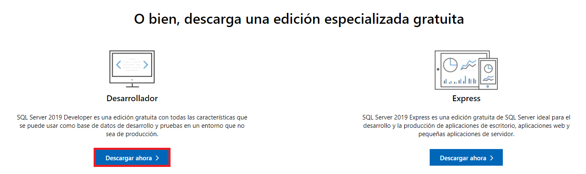
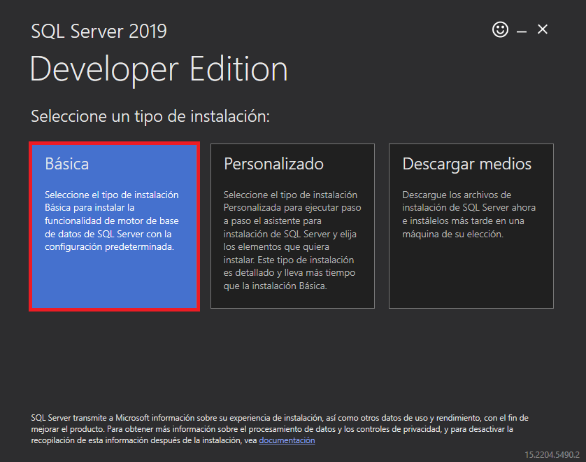
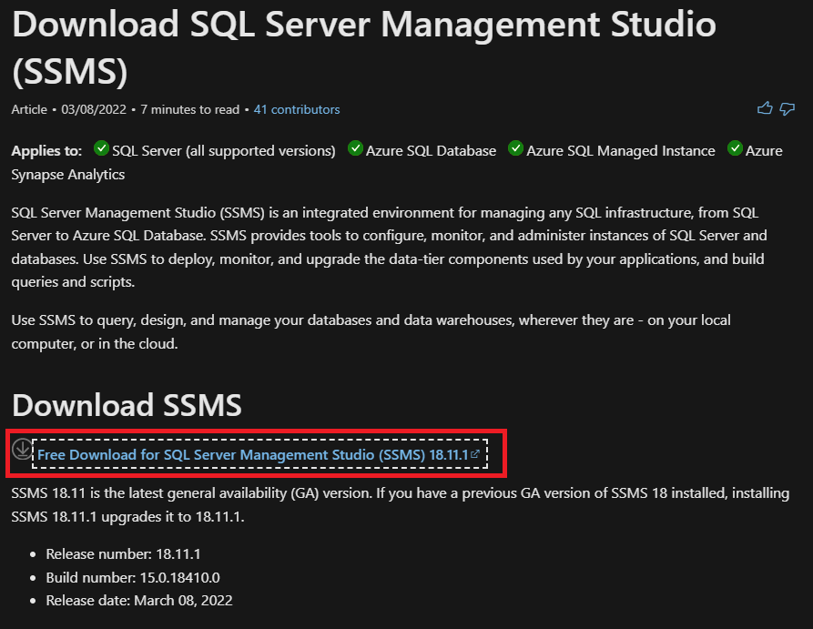
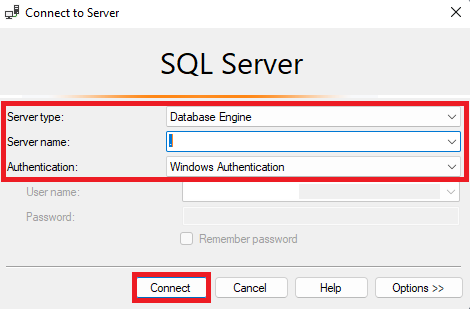

## Instalación de SQL Server
**Microsoft SQL Server** es un sistema de gestión de base de datos relacional, desarrollado por la empresa Microsoft. El lenguaje de desarrollo utilizado es Transact-SQL, una implementación del estándar ANSI del lenguaje SQL, utilizado para manipular y recuperar datos, crear tablas y definir relaciones entre ellas.

1. Descargar el instalador para la ***última versión*** de **SQL Server** desde https://www.microsoft.com/es-es/sql-server/sql-server-downloads. Elegir la ***versión Developer/Desarrollador***. 

2. Ejecutar el instalador y elegir la ***opción básica***.

3. Aceptar los términos.

4. Elegir la ubicación de la instalación (puede ser la que viene por defecto) y presionar el botón "Instalar". 

5. Esperar que termine el proceso de descarga e instalación. 

6. Una vez finalizado, presionar el botón "Cerrar".

:::info Computadoras con bajos recursos 

Si tu computadora no soporta la última versión de SQL Server, podés descargar y usar la versión 2014: https://www.microsoft.com/es-ar/download/details.aspx?id=42299

:::

## Instalación de SQL Server Management Studio
**SQL Server Management Studio (SSMS)** es un entorno de desarrollo integrado para administrar cualquier infraestructura SQL. Permite configurar, consultar, diseñar, monitorear y administrar instancias de SQL Server y bases de datos.

1. Descargar el instalador para la ***última versión*** de **SQL Server Management Studio (SSMS)** desde https://docs.microsoft.com/en-us/sql/ssms/download-sql-server-management-studio-ssms?view=sql-server-ver15. 

2. Elegir la ubicación de la instalación (puede ser la que viene por defecto) y presionar el botón "Install".

3. Esperar que termine el proceso de instalación.

## Verificar que todo funcione
1. Abrir SQL Server Management Studio.

2. Cargar los siguientes datos en la ventana *Connect to Server*:
   1. **Server Type:** Database Engine
   2. **Server Name:** .
   3. **Authentication:** Windows Authentication

3. Presionar el botón "Connect".

4. Si se pudo conectar está todo correcto. Si tuviste algún problema contactá a los docentes.

## Instalación de entonrno SQL Server

<iframe width="560" height="315" src="https://www.youtube.com/embed/ksOeu0lf9dU" title="YouTube video player" frameborder="0" allow="accelerometer; autoplay; clipboard-write; encrypted-media; gyroscope; picture-in-picture" allowfullscreen></iframe>
   